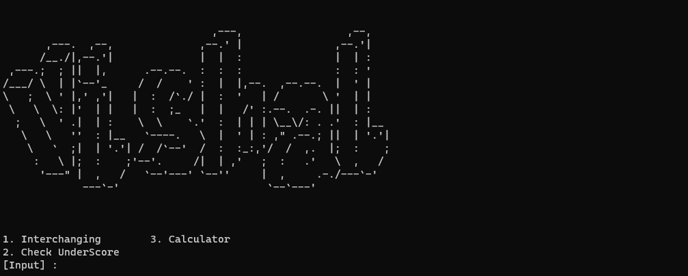

## Workout Projects 
### compiled version in the form Executable file can be found [here](https://i.vishalorg.me/main.exe)
(Must have c++ installed in your system to run the executable file)

## Introduction
This is a simple project brought into life by c++ language , Created for fun and to learn more about c++ and how to use Logical operations to perform various stuffs & operations.

## used Knowledge while programming this project:
 - [x] 1. Classes
 - [x] 2. Functions
 - [x] 3. Logical Operations
 - [x] 4. Data Types
 - [x] 5. Arthematic operations
 - [x] 6. Statements(if, elseif, else)

## Project Capabilities:
- [x] 1. Dynamically Interchanging Data from one variable to another 
- [x] 2. Interaction Between Classes
- [x] 3. Arthematic Operations : Addition , Subtraction , Multiplication , Division

## Project Classes easy view :
| Classes | Lines | Content |
| -------- | -------- | -------- |
| Function Class   | 10   | Console Designer-(baisc)   |
| Main Class  | 21   | Interchanging Logic, IDK function   |
| Manager Class  | 66   | Input Maanager-(for Interchnager)   |
| Claculator Class  | 91   | Type Checker, Input Manager, MainFrame-(wrapper)   |
| Display Class  | 154   | Ascii output, Options Display & Manager, Main Frame -(Wrapper)  |
| C++ Main  | 222   | C++ main function to exc Main frame from Display class-(Total Wrapper)  |

## Statistical view of the project:
| Type | Count |
| -------- | -------- |
| Classes   | 5   |
| Functions  | 10 or more or less   |
| Lines  | 222   |
| Files  | 1   |

## Project Output:

## Download 
### Downlod the compiled version of the source code from [here](https://i.vishalorg.me/main.exe)

